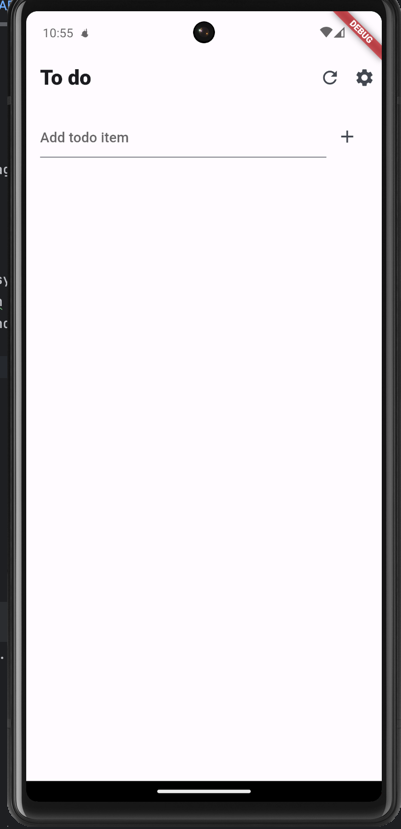

# unicode_todo

Todo app for unicode hiring process

## Introduction

Its a todo app which make use of local storage package hive. Firebase database is being used to store the todos whenever internet is available.

Package used:
- hive for local storage
- riverpod for state management
- firebase cloudstore for online database and data syncing
- firebase auth for managing auth of the applicaiton
- work manager for syncing of tasks in the background

Future improvements:
- time based syncing
- better design , one that is provided by professional app designer
- iOS compatiblity specialy firebase related configurations
- forgot password flow

